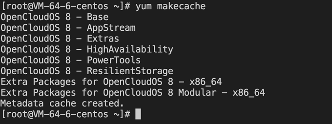

## 操作场景

 CentOS 官方已停止维护 CentOS 8，具体情况如下表所示。如需了解更多信息，请参见 [CentOS官方公告](https://blog.centos.org/2020/12/future-is-centos-stream/?spm=a2c4g.11174386.n2.3.348f4c07hk46v4)。

 | 操作系统版本 | 停止维护时间 | 使用者影响 |
 |---------|---------|---------|
 | CentOS 8  | 2022年01月01日 | 停止维护后将无法获得包括问题修复和功能更新在内的任何软件维护和支持。 |

 若您正在使用 CentOS 8 实例，则可参考本文替换为 OpenCloudOS Server。


 ## 版本说明
 
 **源端主机支持操作系统版本：**
 - 支持 CentOS 8系列操作系统版本：
 CentOS 8.0 64位、CentOS 8.2 64位、CentOS 8.3 64位、CentOS 8.4 64位、CentOS 8.2 ARM 64位

 **目标主机建议操作系统版本：**
 - CentOS 8系列建议迁移至 OpenCloudOS Server 8。

 - CentOS stream 8公共镜像暂时不支持迁移操作。

 ## 注意事项
 
 - 以下情况不支持迁移：
 	- 安装了图形界面。
 	- 安装了i686的 rpm 包。
 - 以下情况可能会影响业务在迁移后无法正常运行：
 	- 业务程序安装且依赖了第三方的 rpm 包。
 	- 业务程序依赖于某个固定的内核版本，或者自行编译了内核模块。迁移后的目标版本是 tkernel4，基于5.4的内核。该版本较 CentOS 8的内核版本更新，一些较旧的特性在新版本可能会发生变化。建议强依赖于内核的用户了解所依赖的特性，或可咨询OpenCloudOS社区 [Bugtracker](https://bugs.opencloudos.tech)。
 	- 业务程序依赖某个固定的 gcc 版本，目前 OpenCloudOS 8默认安装 gcc 8.5。
 - 迁移结束后，需重启才能进入 OpenCloudOS 内核。
 - 迁移不影响数据盘，仅 OS 层面的升级，不会对数据盘进行任何操作。


 ## 资源要求
 
 - 空闲内存大于500MB。
 - 系统盘剩余空间大于10GB。


 ## 操作步骤

 ### 迁移准备

 1. 迁移操作不可逆，为保障业务数据安全，建议您在执行迁移前备份数据,腾讯云服务器用户可参考 [创建快照](https://cloud.tencent.com/document/product/362/5755) 备份系统盘数据。
 2. 检查并手动卸载 i686 的 rpm 包。
 [](id:vault)
 3. 如果您环境里边没有安装 Python 3，需要先进行安装 Python 3操作，可以借助 vault 源进行安装。
 ```python
 # cat <<EOF | sudo tee /tmp/centos8_vault.repo
 [c8_vault_baseos]
 name=c8_vault - BaseOS
 baseurl=https://mirrors.cloud.tencent.com/centos-vault/8.5.2111/BaseOS/\$basearch/os/
 gpgcheck=0
 enabled=1
 [c8_vault_appstream]
 name=c8_vault - AppStream
 baseurl=https://mirrors.cloud.tencent.com/centos-vault/8.5.2111/AppStream/\$basearch/os/
 gpgcheck=0
 enabled=1
 EOF
 # yum -y install python3 --disablerepo=* -c /tmp/centos8_vault.repo --enablerepo=c8_vault*
 ```


 ### 执行迁移

 CentOS 8迁移至 OpenCloudOS8 的步骤如下：

 1. 登录目标主机，腾讯云服务器用户详情请参见 [使用标准登录方式登录 Linux 实例](https://cloud.tencent.com/document/product/213/5436)。
 2. 执行以下命令，安装 Python 3。若 yum 源不可用，则使用上述 [centos-vault 源安装 Python 3](#vault)。
 ```shell
 yum install -y python3
 ```
 3. 执行以下命令，下载安装迁移工具。
 ```shell
 #x86版本
wget https://mirrors.opencloudos.tech/opencloudos/8.6/AppStream/x86_64/os/Packages/migrate2opencloudos-1.0-1.oc8.noarch.rpm
#arm版本
wget https://mirrors.opencloudos.tech/opencloudos/8/AppStream/aarch64/os/Packages/migrate2opencloudos-1.0-1.oc8.noarch.rpm 
 ```
 4. 执行以下命令安装迁移工具,该命令会在 /usr/sbin下创建 migrate2opencloudos.py。
 ```shell
 rpm -ivh migrate2opencloudos-1.0-1.oc8.noarch.rpm
 ```

 5. 执行以下命令，开始迁移。

 ```shell
 python3 /usr/sbin/migrate2opencloudos.py -v 8
 ``` 
迁移需要一定时间，请耐心等待。脚本执行完成后，输出如下图所示信息，表示已完成迁移。


 6. 重启实例，云服务器详情请参见 [重启实例](https://cloud.tencent.com/document/product/213/4928)。

 7. 检查迁移结果。
 	1. 执行以下命令，检查 os-release。
 	```shell
 	cat /etc/os-release
 	```
 	返回如下图所示信息：

      

 	2. 执行以下命令，检查内核。

 	```shell
 	uname -r
 	```

 	返回如下图所示信息：  
 	 

 	内核默认为 yum 最新版本，请以您的实际返回结果为准，本文以图示版本为例。


 	3. 执行以下命令，检查 yum。
 	```shell
 	yum makecache
 	```

 	返回如下图所示信息：

 	
  
 ## 遇到问题？
 
 若您在迁移过程中遇到问题，请联系OpenCloudOS社区 [Bugtracker](https://www.opencloudos.org/?page_id=509)。
