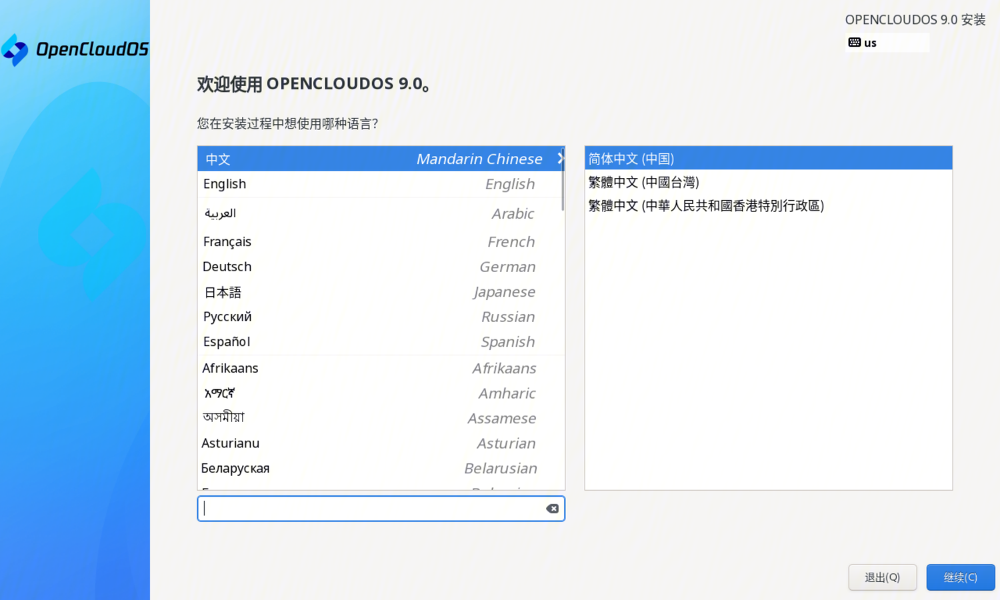
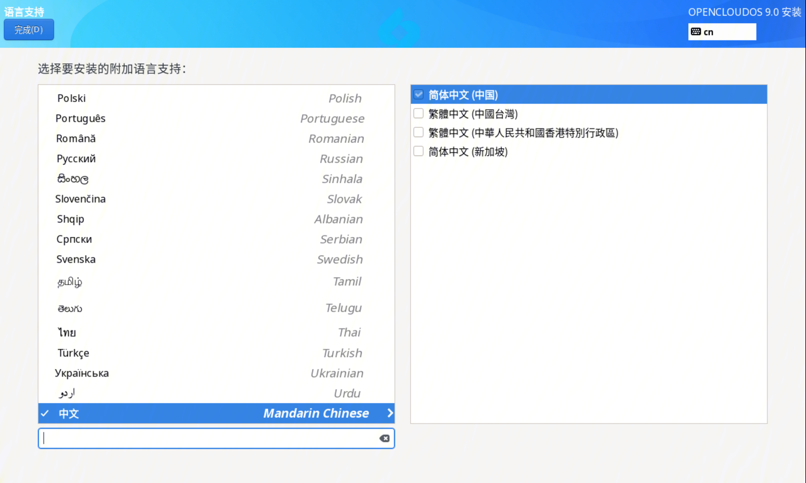
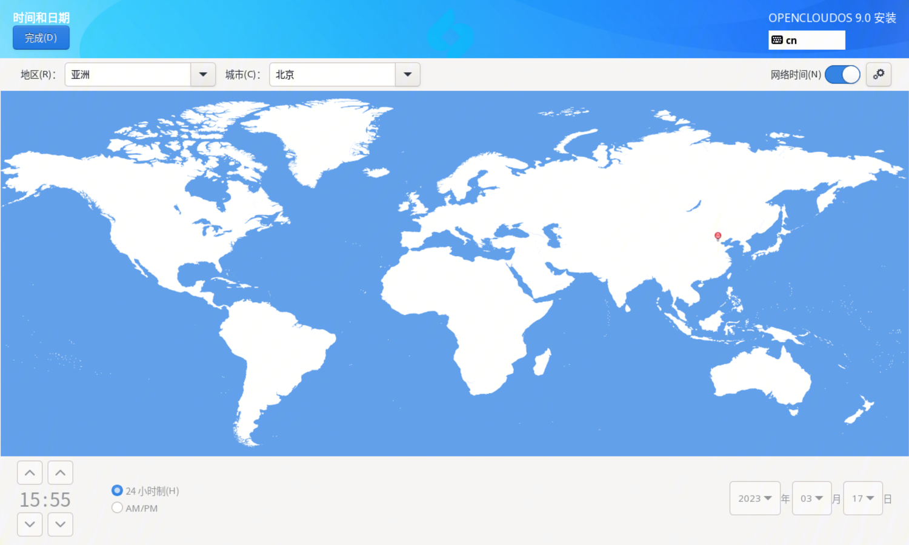
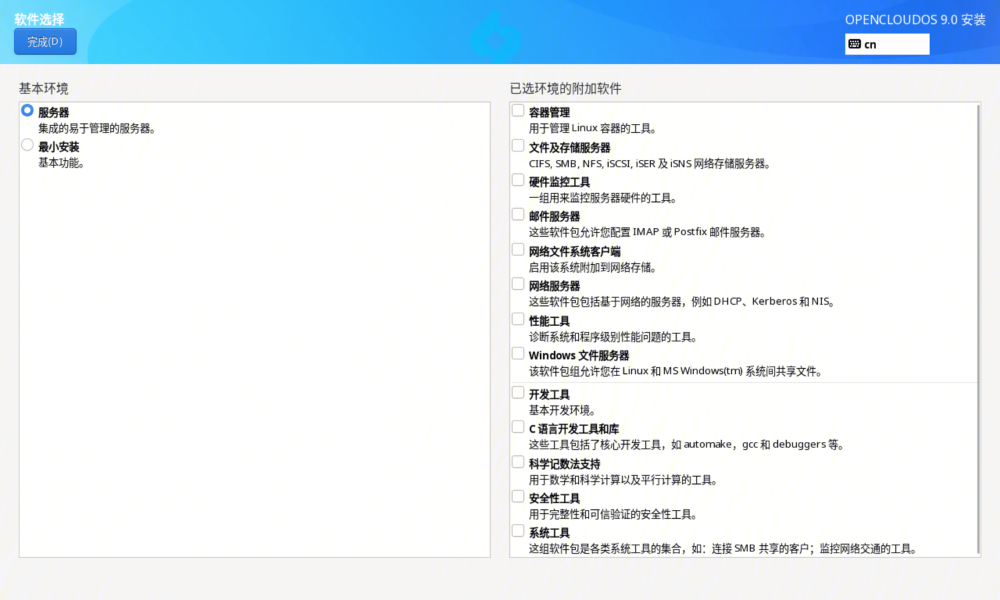
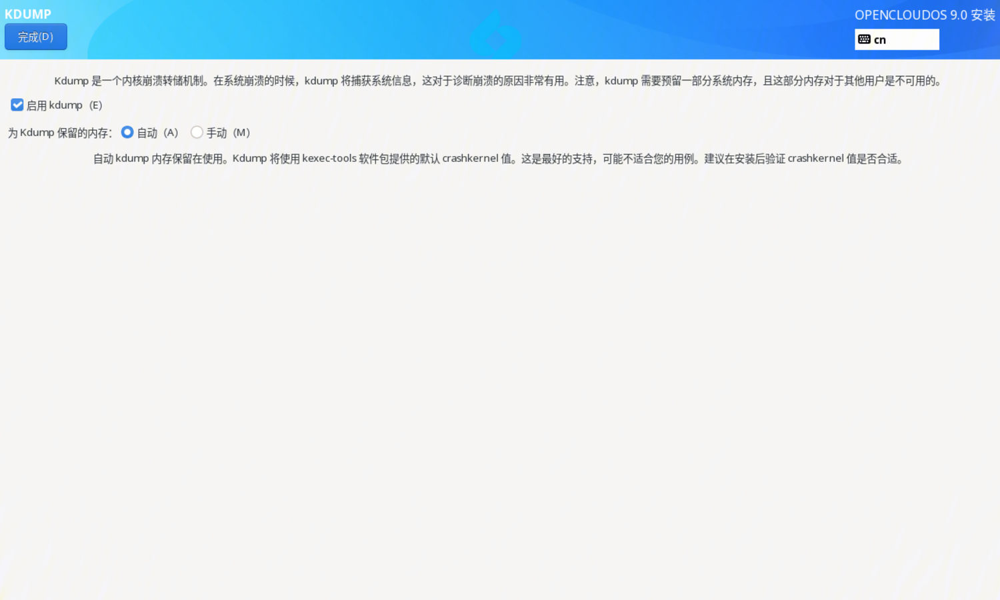
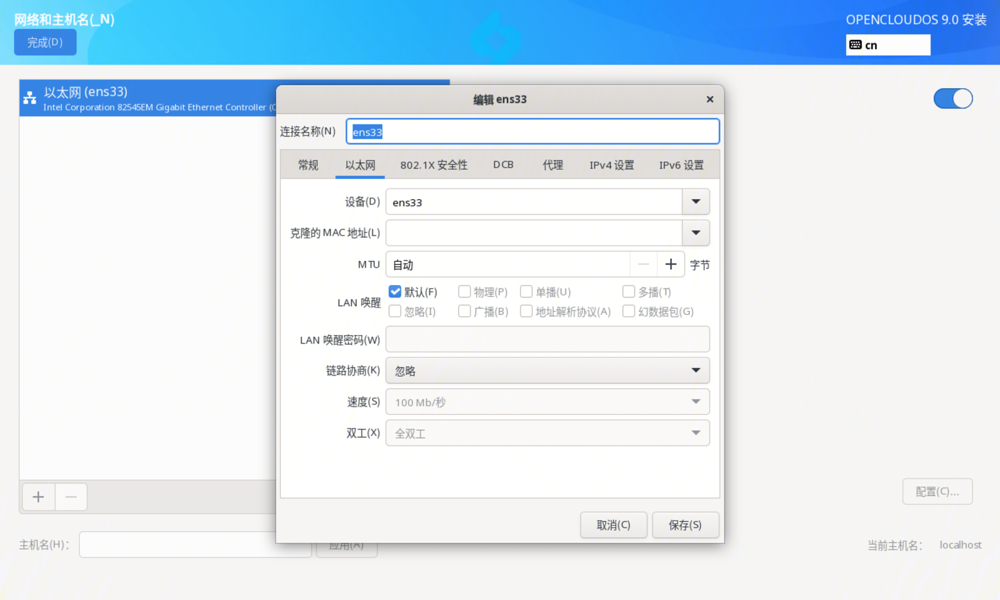
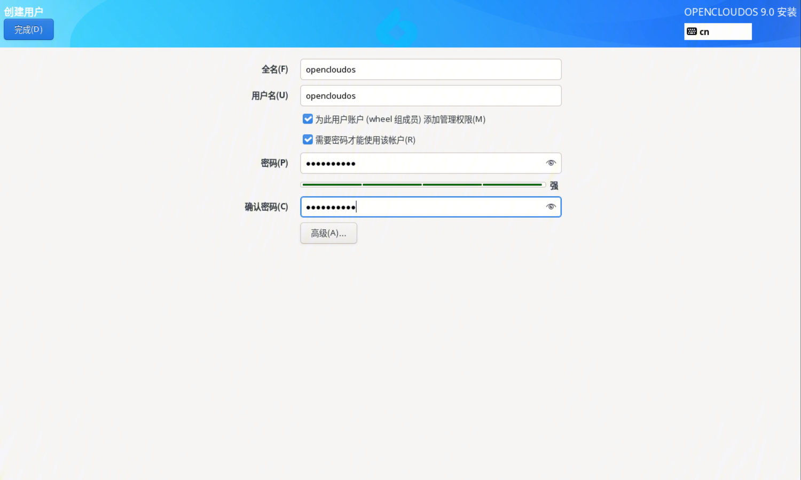

# Overview
OpenCloudOS 9 is a next-generation server operating system distribution developed based on the upstream OpenCloudOS Stream community. Its kernel and user mode software are independently evolved, self-compiled, independently selected and maintained, and no longer depend on other distributions. Through the comprehensive optimization and polishing of the kernel and user-mode software, a more advanced and higher-performance basic environment and service capabilities are provided for users and businesses.

## 1 Install methods

### 1.1 GUI-based installation

The GUI-based installation has the following installation methods:

- Use the ISO image to perform local installation. This article mainly introduces the GUI-based ISO image installation.
- Perform remote installation using VNC
- Perform a network installation using PXE

### 2.2 Installation based on text interface

The GUI-based installation has the following installation methods:

- Perform a local installation using an ISO image
- Perform a network installation using PXE

## 3. Installation preparation

### 3.1 Supported Architectures

OpenClousOS 9 supports the following architectures:

- AMD, Intel, and ARM 64-bit architectures

### 3.2 System Requirements
Before installing the OpenCloudOS 9 server operating system, your server needs to meet the following requirements:

- The server is connected to a stable power supply
- Make sure the server has at least **50GB of hard disk space and 4GB of memory space**
- **Please back up your hard disk data before installation to prevent data loss**
- Version compilation supports cpu v2 microarchitecture instructions, so it needs to be deployed on physical machines and virtual machines that support microarchitecture v2 and above
- When deploying with docker, the version needs to be > 20.10.9. If it is less than or equal to the above version, there will be problems involving clone system calls such as dnf install cannot be resolved

### 3.3 Verified Platforms

The verified physical machine platforms are as follows:

| | | |
|:--|:--|:--|
|Physical machine platform |architecture |Specification |
|Intel server |x86_64 |x86 96 cores Intel(R) Xeon(R) Platinum 8255C CPU @ 2.50GHz memory 256G, HDD 500G, SSD 3.6T, dual network card |
|Hygon server |x86_64 |x86 128 cores Hygon 7380CPU@ 2.20GHz memory 512G, HDD 500G, SSD 3.6T, dual network card |
|TaiShan server |aarch64 |aarch64 Kunpeng-920 128cores 2.6GHz memory512G, HDD 500G, SSD 3.6T, dual 25G network card |

Validated virtual machine platforms are as follows:

| | | | | |
|:--|:--|:--|:--|:--|
|virtualization platform |HostOS |Host architecture |Host chip |firmware |
|qemu |MacOS |aarch64 |Apple M1 |UEFI |
|Parallels |MacOS |aarch64 |Apple M1 |UEFI |
|qemu |TencentOS Server |aarch64 |Kunpeng-920 |UEFI |
|vmware |Windows |x86_64 |Intel |UEFI/BIOS |
|virtualbox |Windows |x86_64 |Intel |UEFI/BIOS |
|Hyper V |Windows |x86_64 |Intel |UEFI/BIOS |
|qemu |TencentOS Server |x86_64 |Intel |UEFI/BIOS |

### 3.4 Get the installation image
#### 3.4.1 everything ISO
The everything ISO image file contains all software packages, which are divided into two software warehouses, BaseOS and AppStream, and can be installed directly without configuring additional software sources.

- [OpenCloudOS-9.0-x86_64-everything.iso ](https://mirrors.opencloudos.org/opencloudos/9.0/isos/x86_64/OpenCloudOS-9.0-x86_64-everything.iso)
- [OpenCloudOS-9.0-aarch64-everything.iso](https://mirrors.opencloudos.org/opencloudos/9.0/isos/aarch64/OpenCloudOS-9.0-aarch64-everything.iso)

#### 3.4.2 netinst ISO
The netinst ISO image file does not contain any software packages. You need to configure the network installation source on the installation source setting interface, and then install it. For the configuration method, please refer to the installation guide > software source section.

- [OpenCloudOS-9.0-x86_64-netinst.iso](https://mirrors.opencloudos.org/opencloudos/9.0/isos/x86_64/OpenCloudOS-9.0-x86_64-netinst.iso)
- [OpenCloudOS-9.0-aarch64-netinst.iso](https://mirrors.opencloudos.org/opencloudos/9.0/isos/aarch64/OpenCloudOS-9.0-aarch64-netinst.iso)

## 4. Installation guide

### 4.1 Boot Menu

After the system has finished booting from the boot media, the OpenCloudOS 9 boot menu is displayed using GRUB2, as shown in the following figure:

Use the up and down arrow keys on the keyboard to select different boot items, and press the "Enter" key to enter the corresponding boot item after selection. If there is no operation within 60s, it will enter the highlighted boot item by default. Press the "e" key to modify the selected boot item. After the modification is completed, press Ctrl+X to make the modification effective and continue to start. Press the "c" key to enter the grub command line. The boot menu options are described below:

| | |
|:--|:--|
|Boot Menu Options |description |
|Install OpenCloudOS 9 |Start GUI installation OpenCloudOS 9. |
|Test this media &amp; install OpenCloudOS 9 |The default option, checks the integrity of the installation media and starts the GUI to install OpenCloudOS 9. |
|Troubleshooting |Problem location options. |
|Troubleshooting --> Rescue a OpenCloudOS 9 |Rescue mode, in which problem location and repair can be performed. |

### 4.2 Installation language setting interface

Keep the default boot option in the boot menu to enter Install OpenCloudOS 9 or Test this media & install OpenCloudOS 9. After a while, the system will enter the graphical installation interface. The first display is the installation language setting interface, which sets the language used during the installation process, and the default is Simplified Chinese.

After the setting is complete, click the "Continue" button to enter the main interface of the installation. If you want to exit the installation, click the "Exit" button, the system will reboot and reboot into the boot menu.

### 4.3 Graphical mode installation main interface

The main interface of the installation is shown in the figure below:

In the main installation interface, users can set keyboard, language, time and date, installation source, software selection, installation disk, KDUMP, network and user settings. There is a warning symbol in the lower right corner of the icon, indicating that the option has not been set or is set incorrectly. After all the warning symbols on the installation main interface are eliminated, the start installation button in the lower right corner can be clicked. If you want to exit the installation, click the "Exit" button, the system will reboot and reboot into the boot menu. 

Next, each installation setting item will be described.

### 4.4 Keyboard

Click "Keyboard" on the main installation interface to enter the keyboard layout interface, as shown in the figure below: 

- View keyboard layout: Click the keyboard icon below the left box to view the current keyboard layout.
- Add a keyboard layout: Click the plus icon below the box on the left. 
- Delete keyboard layout: Select the keyboard layout to be deleted, click the minus icon below the left selection box, if there is only one keyboard layout, you need to re-select a keyboard layout to replace the current keyboard layout. 
- Test keyboard layout: If there are multiple keyboard layouts, click the keyboard icon in the upper right corner to switch, and enter the input test in the text library on the right.

After the setting is complete, click the "Finish" button to return to the main interface of the installation.

### 4.5 Language support

Click "Language Support" on the main installation interface to enter the language support interface, as shown in the figure below: 

Select the language to be supported in the check box on the right. After the setting is complete, click the "Finish" button to return to the main interface of the installation.

### 4.6 Time and date

Click "Time and Date" on the main installation interface to enter the time and date setting interface, as shown in the figure below:

Set time zone: You can set it through the drop-down box of region and city in the upper left corner, or click the map setting. Note: If you need to manually set the date and time, you need to turn off the network time in the upper right corner. After the setting is complete, click the "Finish" button to return to the main interface of the installation.

### 4.7 Installation sources

Click "Installation Source" on the main installation interface to enter the installation source setting interface, as shown in the following figure:

- Automatically detected installation media: When everything.iso is used for installation, the installation program will automatically detect the installation media, just keep the default.
- ISO file: You can click the "Select ISO button" on the right to select the ISO file where the installation source exists.
- On the Internet: 
	- http/https method: enter the URL of the network installation source in the text box on the right
	- ftp method: enter the ftp address of the network installation source in the text box on the right
	- nfs mode: enter the nfs address of the network installation source in the text box on the right
- Additional software warehouse: There are three ways to set up an additional software warehouse: http/https, ftp, and nfs, and the setting method is the same as above. 
After the setting is complete, click the "Finish" button to return to the main interface of the installation.

### 4.8 Software Selection

If the software source is set correctly, click "Software Selection" on the main installation interface to enter the software selection setting interface. The following figure shows the default configuration of everything.iso:

Currently, OC9 has two basic installation environments of server and minimal installation by default, and different numbers of software packages are installed by default in each installation environment. After the basic environment is selected, the optional software groups in the current software environment are displayed on the right. Users can choose to install according to their needs. After the setting is complete, click the "Finish" button to return to the main interface of the installation.

### 4.9 Installation Destination

Click "Installation Destination" on the main installation interface to enter the installation destination setting interface, as shown in the figure below: 

- Local standard disk: select the disk to be installed with the operating system
- Edicated disk & network disk: add a dedicated disk and network disk 
- Storage Configuration: 
The default is automatic, the installer automatically partitions. If you do not check Free up space by deleting or compressing existing partitions, it will be installed to the remaining space of the selected disk by default. When there is insufficient space, a dialog box will prompt the user to reclaim space. You can also free up space by checking the box to delete or compress existing partitions, and actively reclaim space. If you select Custom, click the Finish button to enter the manual partition interface, as shown in the figure below:

Automatic creation: If there is enough space, the system will automatically create partitions according to the available storage space. 
Manual creation: Click the "+" button to create a new mount point, and set it according to the prompts. After the creation is complete, select the partition, and on the right side you can set the mount point, expected capacity, device type, file system, etc. of the partition, as shown in the figure below: 

After the settings are complete, click the "Finish" button and accept the changes to return to the main installation interface.

### 4.10 KDUMP

Click "KDUMP" on the main installation interface to enter the KDUMP setting interface, as shown in the following figure: 

- Enable kdump: checked by default, enable kdump after checking, disable kdump if unchecked
- Memory reserved for Kdump: required to enable kdump Reserve memory. If Auto is selected, it is configured according to the memory size; If Manual is selected, the reserved memory value needs to be manually set.

After the setting is complete, click the "Finish" button to return to the main interface of the installation.

### 4.11 Network and hostname

Click "Network and Host Name" on the main installation interface to enter the network and host name setting interface, as shown in the figure below: 

Set host name: Enter the host name to be set in the host name text box, and click the "Apply" button to take effect. 

Configure the network: Select the network port in the box on the left, click the "Configure" button to configure the network, the configuration interface is as follows: 

After the settings are completed, click the "Finish" button to return to the main interface of the installation.

### 4.12 Root account

Click "Root Account" on the main installation interface to enter the Root account setting interface, as shown in the figure below, the installation program disables the root account by default:

After choosing to enable the root account, you need to set the root account password. At the same time, you can set whether to allow the root user to use the password for SSH login.

After the setting is complete, click the "Finish" button to return to the main interface of the installation.

### 4.13 Create user

Click "Create User" on the main interface of the installation to enter the interface for creating a user, as shown in the following figure:

Users can set user name and user password. If the root account is disabled, a regular user must be created. 

After the setting is complete, click the "Finish" button to return to the main interface of the installation.

### 4.14 Installation complete

After all the necessary project settings are completed, you can click the "Start Installation" button in the lower right corner, click to start the installation, enter the installation progress interface, and wait for the installation to complete.

After the installation is complete, the "Restart System" button in the lower right corner can be clicked. After clicking, the system will restart and enter the installed system.

### 4.15 Log in

After restarting, start normally, and you can see the OpenCloudOS boot interface appearing in the system directory.

After completing the system installation, enter the login interface.

## 5. Related Information

- The qcow2 mirror creates a root user and an ordinary user by default, and its username/password is as follows:

    - root/Dis@init3
    - opencloudos/opencloudos
