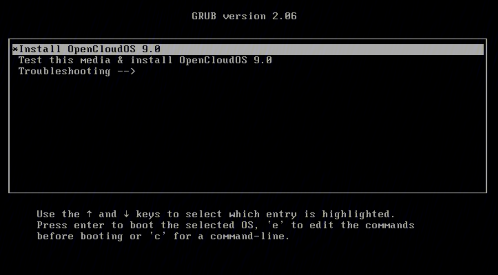
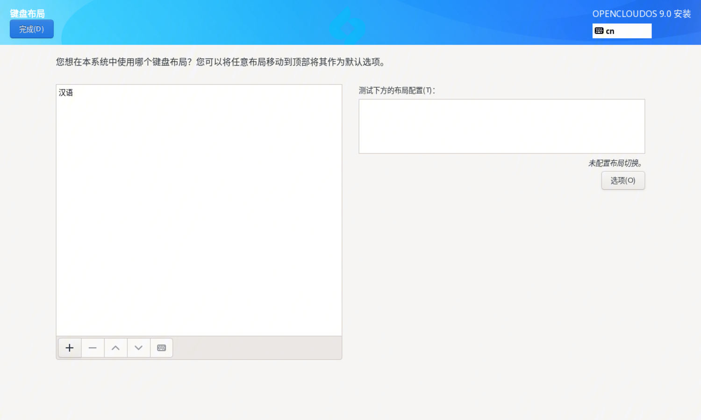
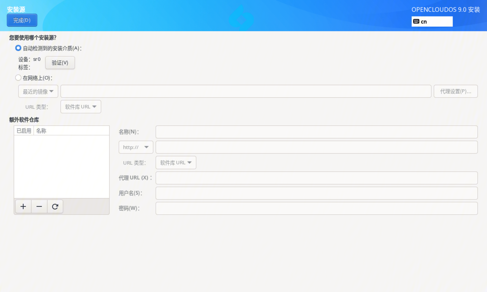
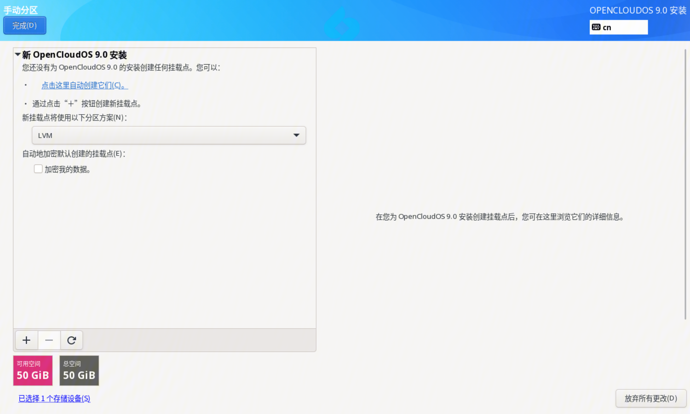
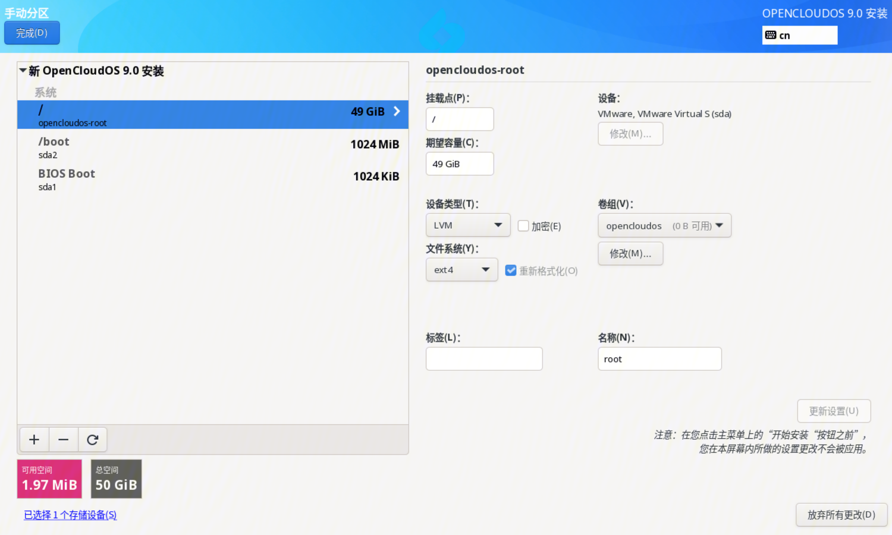
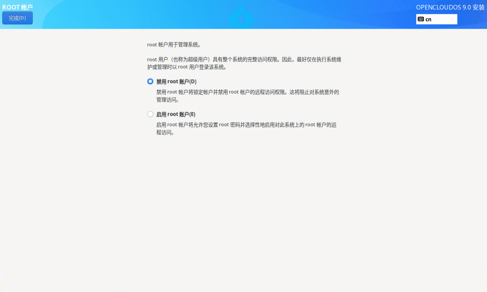
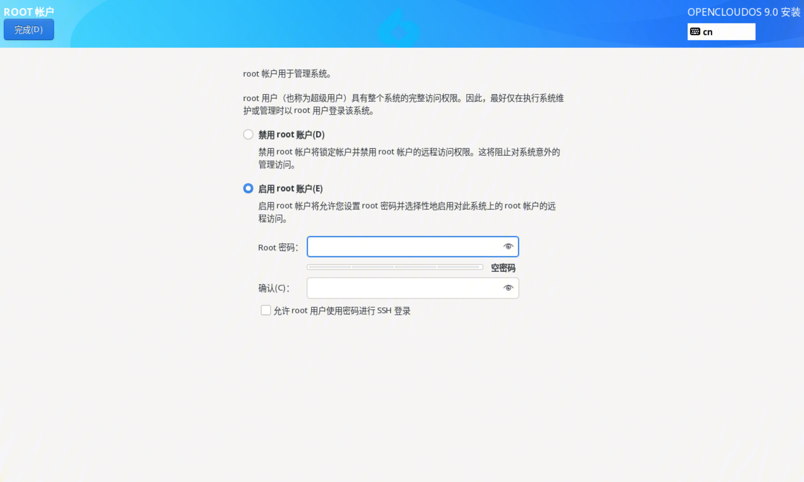
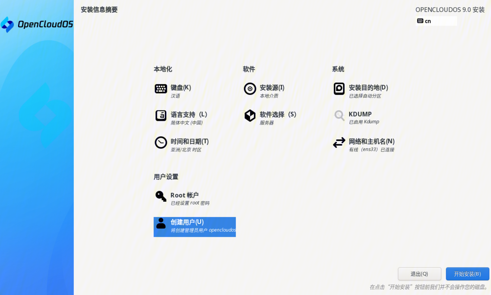
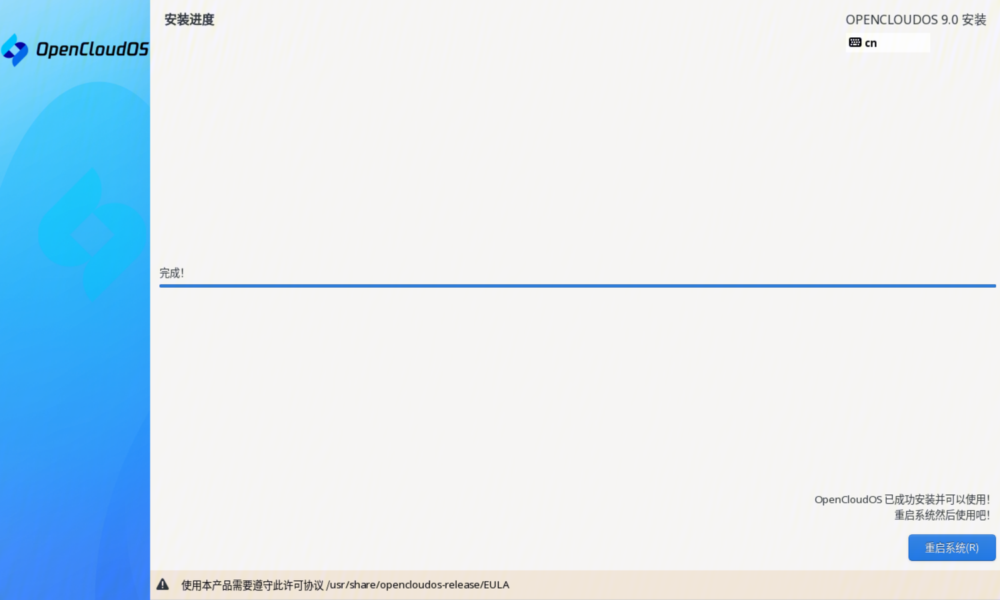
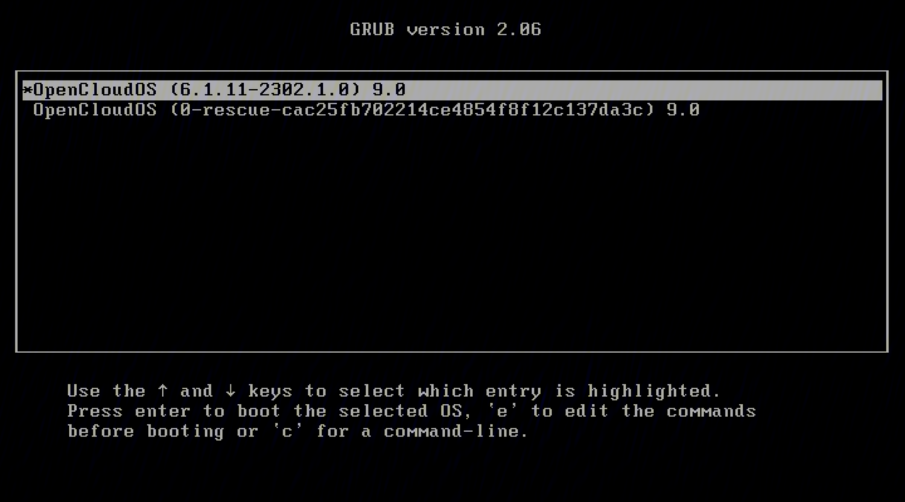

# 1. 概述
OpenCloudOS 9 是基于上游 OpenCloudOS Stream 社区研发的下一代服务器操作系统发行版，其内核及用户态软件均独立演进、自编译，独立选型和维护，不再依赖其他发行版。通过内核，用户态软件的全面优化和打磨，为用户和业务提供更先进、更高性能的基础环境和服务能力。

# 2. 安装方式

## 2.1 基于图形界面的安装

基于图形界面的安装有以下几种安装方式：

- 使用 ISO 镜像执行本地安装，本文主要介绍基于图形界面的 ISO 镜像安装。
- 使用 VNC 执行远程安装
- 使用 PXE 执行网络安装

## 2.2 基于文本界面的安装

基于图形界面的安装有以下几种安装方式：

- 使用 ISO 镜像执行本地安装
- 使用 PXE 执行网络安装

# 3. 安装准备

## 3.1 支持的架构

OpenClousOS 9 支持如下架构：

- AMD、Intel 和 ARM 64 位架构

## 3.2 系统要求
安装 OpenCloudOS 9 服务器操作系统前，您的服务器需要满足以下要求：

- 服务器接入稳定电源
- 确保服务器至少拥有**50GB硬盘空间，4GB内存空间**
- **安装前请备份您的硬盘数据，以防数据丢失**
- 版本编译支持cpu v2微架构指令，因此需要在支持v2及以上微架构的物理机、虚拟机部署
- 使用docker部署时，版本需要 > 20.10.9，如果小于等于上述版本，会出现dnf install无法解析等涉及clone系统调用的问题

## 3.3 已验证平台

已验证的物理机平台如下所示：

| | | |
|:--|:--|:--|
|物理机平台 |架构 |规格 |
|Intel 服务器 |x86_64 |x86 96核 Intel(R) Xeon(R) Platinum 8255C CPU @ 2.50GHz 内存 256G，HDD 500G，SSD 3.6T，双网卡 |
|Hygon 服务器 |x86_64 |x86 128核 Hygon 7380CPU@ 2.20GHz 内存 512G，HDD 500G，SSD 3.6T，双网卡 |
|泰山服务器 |aarch64 |aarch64 Kunpeng-920 128核2.6GHz 内存512G，HDD 500G，SSD 3.6T，双25G网卡 |

已验证的虚拟机平台如下所示：

| | | | | |
|:--|:--|:--|:--|:--|
|虚拟化平台 |HostOS |Host架构 |Host 芯片 |固件 |
|qemu |MacOS |aarch64 |Apple M1 |UEFI |
|Parallels |MacOS |aarch64 |Apple M1 |UEFI |
|qemu |TencentOS Server |aarch64 |Kunpeng-920 |UEFI |
|vmware |Windows |x86_64 |Intel |UEFI/BIOS |
|virtualbox |Windows |x86_64 |Intel |UEFI/BIOS |
|Hyper V |Windows |x86_64 |Intel |UEFI/BIOS |
|qemu |TencentOS Server |x86_64 |Intel |UEFI/BIOS |

## 3.4 获取安装镜像
### 3.4.1 everything ISO
everything ISO 镜像文件包含了所有软件包，分为 BaseOS 和 AppStream 两个软件仓库，无需配置额外的软件源，可以直接进行安装。

- [OpenCloudOS-9.0-x86_64-everything.iso ](https://mirrors.opencloudos.org/opencloudos/9.0/isos/x86_64/OpenCloudOS-9.0-x86_64-everything.iso)
- [OpenCloudOS-9.0-aarch64-everything.iso](https://mirrors.opencloudos.org/opencloudos/9.0/isos/aarch64/OpenCloudOS-9.0-aarch64-everything.iso)

### 3.4.2 netinst ISO
netinst ISO 镜像文件不包含任何软件包，需要在安装源设置界面配置网络安装源，然后进行安装，配置方式可以参考 安装指导>软件源 一节。

- [OpenCloudOS-9.0-x86_64-netinst.iso](https://mirrors.opencloudos.org/opencloudos/9.0/isos/x86_64/OpenCloudOS-9.0-x86_64-netinst.iso)
- [OpenCloudOS-9.0-aarch64-netinst.iso](https://mirrors.opencloudos.org/opencloudos/9.0/isos/aarch64/OpenCloudOS-9.0-aarch64-netinst.iso)

# 4. 安装指导

## 4.1 引导菜单

系统通过引导介质完成引导后，会使用 GRUB2 显示 OpenCloudOS 9 引导菜单，如下图所示：

使用键盘上下方向键选择不同的引导项，选中后按 "Enter" 键进入对应的引导项。如果 60s 内没有操作，则默认进入高亮引导项。
按 "e" 键可以修改选中的引导项，修改完成后，按 Ctrl+X 使修改生效，并继续启动。
按 "c" 键进入 grub 命令行。
引导菜单选项说明如下：

| |
|:--|
|引导菜单选项 |描述 |
|Install OpenCloudOS 9 |启动图形界面安装 OpenCloudOS 9。 |
|Test this media &amp; install OpenCloudOS 9 |默认选项，检查安装介质的完整性并启动图形界面安装 OpenCloudOS 9。 |
|Troubleshooting |问题定位选项。 |
|Troubleshooting --> Rescue a OpenCloudOS 9 |救援模式，在该模式下可进行问题定位和修复。 |

## 4.2 安装语言设置界面

引导菜单保持默认启动选项进入 Install OpenCloudOS 9 或者 Test this media &amp; install OpenCloudOS 9，启动一段时间后系统会进入图形安装界面。
首先显示的是安装语言设置界面，该界面设置安装过程中使用的语言，默认为简体中文。

设置完成后，单击 "继续" 按钮，进入安装主界面。如果想要退出安装，单击 "退出" 按钮，系统会重启并重新引导进入引导菜单。

## 4.3 图形模式安装主界面

安装主界面如下图所示：

在安装主界面，用户可以进行键盘、语言、时间和日期、安装源、软件选择、安装磁盘、KDUMP、网络及用户等设置。
图标右下角存在告警符号，表示该选项未设置完成或者设置错误。安装主界面所有告警符号消除后，右下角的开始安装按钮才可以点击。
如果想要退出安装，单击"退出"按钮，系统会重启并重新引导进入引导菜单。
接下来对各个安装设置项进行说明。

## 4.4 键盘

在安装主界面单击"键盘"，进入键盘布局界面，如下图所示：

- 查看键盘布局：单击左侧选框下方的键盘图标查看当前键盘布局。
- 添加键盘布局：单击左侧选框下方的加号图标。
- 删除键盘布局：选中待删除的键盘布局，单击左侧选框下方的减号图标，如果当前只有一个键盘布局，则还需要重新选择一个键盘布局以替换当前键盘布局。
- 测试键盘布局：如果当前存在多个键盘布局，单击右上角键盘图标可以切换，在右侧文本库进入输入测试。

设置完成后，单击"完成"按钮回到安装主界面。

## 4.5 语言支持

在安装主界面单击"语言支持"，进入语言支持界面，如下图所示：

右侧复选框选中需要支持的语言。
设置完成后，单击"完成"按钮回到安装主界面。

## 4.6 时间和日期

在安装主界面单击"时间和日期"，进入时间和日期设置界面，如下图所示：

设置时区：可通过左上角地区和城市下拉框设置，也可以点击地图设置。
注意：如果需要手动设置日期和时间，需要关闭右上角网络时间。
设置完成后，单击"完成"按钮回到安装主界面。

## 4.7 安装源

在安装主界面单击"安装源"，进入安装源设置界面，如下图所示：

- 自动检测到的安装介质：当使用 everything.iso 进行安装时，安装程序会自动检测安装介质，保持默认即可。
- ISO 文件：可以单击右侧"选择 ISO 按钮" 选择存在安装源的 ISO 文件。
- 在网络上：
	- http/https 方式：右侧文本框中输入网络安装源的 URL
	- ftp 方式：右侧文本框中输入网络安装源的 ftp 地址
	- nfs 方式：右侧文本框中输入网络安装源的 nfs 地址
- 额外软件仓库：设置额外的软件仓库，存在 http/https、ftp、nfs 三种方式，设置方法与上述相同。
设置完成后，单击"完成"按钮回到安装主界面。

## 4.8 软件选择

如果软件源设置正确，在安装主界面单击"软件选择"，进入软件选择设置界面，下图为 everything.iso 默认配置：

当前 OC9 默认有服务器和最小安装两个基本安装环境，每个安装环境下会默认安装不同数量的软件包。
选中基本环境后，右侧显示当前软件环境下可选的软件组。用户可以根据需要选择安装。
设置完成后，单击"完成"按钮回到安装主界面。

## 4.9 安装目的地

在安装主界面单击"安装目的地"，进入安装目标设置界面，如下图所示：

- 本地标准磁盘：选择待安装操作系统的磁盘
- 专用磁盘 &amp; 网络磁盘：添加专用磁盘和网络磁盘 
- 存储配置：
默认为自动，安装程序自动进行分区。如果未勾选通过删除或压缩已有分区来释放空间，则默认安装到选中磁盘的剩余空间，空间不足时会通过对话框提示用户回收空间。
也可以通过勾选删除或压缩已有分区来释放空间，主动进行空间回收。
如果选中自定义，单击完成按钮，则进入手动分区界面，如下图所示：

自动创建：如果空间充足，系统会根据可用存储空间自动创建分区。
手动创建：点开 "+" 按钮创建新挂载点，根据提示设置即可。创建完成后，选中该分区，右侧可以设置该分区挂点、期望容量、设备类型、文件系统等，如下图所示：

设置完成后，单击"完成"按钮并接受更改回到安装主界面。

## 4.10 KDUMP

在安装主界面单击"KDUMP"，进入 KDUMP 设置界面，如下图所示：

- 启用 kdump：默认勾选，勾选后启用 kdump，不勾选则禁用 kdump
- 为 Kdump 保留的内存：启用 kdump 需要预留内存。选中自动，则根据内存大小配置，选中手动，则需要手动设置保留的内存数值。

设置完成后，单击"完成"按钮回到安装主界面。

## 4.11 网络和主机名

在安装主界面单击"网络与主机名"，进入网络与主机名设置界面，如下图所示：

设置主机名：在主机名文本框输入需要设置的主机名，单击"应用"按钮生效。
配置网络：左侧选框选中网口，单击"配置"按钮进行网络配置，配置界面如下：

设置完成后，单击"完成"按钮回到安装主界面。

## 4.12 Root 账户

在安装主界面单击"Root 账户"，进入Root 账户设置界面，如下图所示，安装程序默认禁用 root 账户：

选择启用 root 账户后，需要设置 root 账户密码。同时可以设置是否允许 root 用户使用密码进行 SSH 登陆。

设置完成后，单击"完成"按钮回到安装主界面。

## 4.13 创建用户

在安装主界面单击"创建用户"，进入创建用户界面，如下图所示：

用户可以设置用户名和用户密码。如果 root 账户被禁用，则必须创建普通用户。
设置完成后，单击"完成"按钮回到安装主界面。

## 4.14 安装完成

所有必要的项目设置完成后，右下角的"开始安装"按钮则可以点击，单击开始安装，进入安装进度界面，等待安装完成。

安装完成后，右下角的"重启系统"按钮则可以点击，单击后，系统重启进入安装好的系统。

## 4.15 如何登陆

重启后，正常启动，可以看到系统目录中出现 OpenCloudOS 引导界面。

完成安装系统后，进入到登陆界面。

# 5. 相关信息

- qcow2 镜像默认创建了 root 用户和一个普通用户，其用户名/密码如下：

    - root/Dis@init3
    - opencloudos/opencloudos
